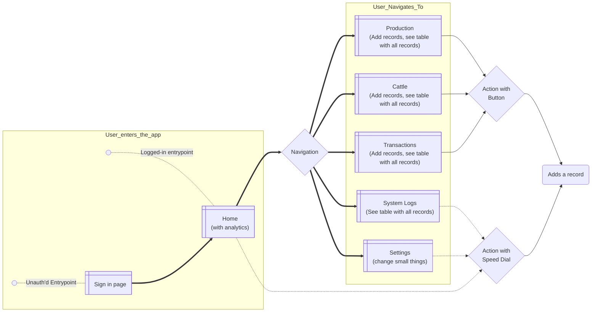

# Product Requirement Document of Keso App

## Overview

Keso App is a mobile-first web-based farm management solution designed for small to medium-sized cheese farms, focusing on simplicity and ease of use. The app enables workers to record daily operations while providing owners with clear business insights.

## Problem

1. Poor communication and reporting create trust issues between workers and owners
2. No reliable system for tracking production, inventory, and expenses
3. Existing solutions are either:

    - Too complex (spreadsheets, specialized software)
    - Unreliable (paper records)
    - Expensive (custom development)
    - Inflexible (no-code solutions)

##  Solution

Offer a lightweight CRUD web app with these core features:

1. Simple mobile-first interface
2. Transparent record-keeping
3. Easy team collaboration
4. Quick overview of the farm numbers

### Target users

Based on conversations with the stakeholders:

 1. Farm workers: recording operations
 2. Farm Supervisor: recording transactions
 3. Owner's Business Manager: analyzing results
 4. Owner: checking status

### Goals

- Help people record, track and audit their operations
- Promote transparency and trust between teams
- Prepare the business for technology integrations

## Conceptual model

Here is a high-level conceptual model of the navigation flow:

## Requirements

Build an MVP that solves the problem: farm workers who need to record the operations. Phasing starts with building the main features, then adding authentication and roles.

### Users

1. Admin: Full system access
2. Owner: Table editing and user management
3. Farm Worker: Basic operations recording

### User Interface

 - This SPA will have these 'screens': home, production, cattle, transactions, audit, settings (and the signin page for unauthenticated users)
 - All screens will have a speed dialer component with the most common 'actions': record milk batch, record cheese batch and record a transaction (both in and out)
 - To perform the 'operations', a dialog will be open with a simple form, a cancel button, a submit button and a close button

#### Home

Landing page for auth users. It'll have a simple dashboard, with these metrics:

 - Daily milk production average (Card with number)
 - Milk-to-cheese conversion ratio (Card with number)
 - Available cheese inventory (Card with number)
 - SCow age distribution (Pie chart: Young -> up to 2 years, Mature -> between 2 and 6, Old -> over 6)
 - The last 5 transactions (Table)

#### Production

An AGrid table, with the info related to the production. It'll have at the top a button to add an operation (depending on the active tab, it'll mention which one), then two tabs to select the type of product (milk or cheese). As filters, it'll have: 

 - Date picker
 - Users who recorded the operation

#### Cattle

An AGrid table, with all the cows. It'll have at the top a button to add a cow, then two tabs to select between two tables (Cows, Births). As filters, it'll have:

 - Cow age: young (under 2 years), mature (between 2 and 6 years), old (over 6 years)
 - Milk production avg: it'll have 3 levels
 - For the births table, a date picker for the date of birth

#### Transactions

An AGrid table, with the info related to transactions. It'll have at the top two buttons (add money in and add money out), then two tabs to select the type of view (inventory or transactions). As filters, it'll have: 

- Date picker (for transactions)
- Type of transaction (for transactions, just two: money out and in), it'll be toggle

#### System logs

An AGrid table, with the info related to logs. As filters, it'll have: 

- User
- Action
- Date picker

#### Settings

For all users:

- Profile settings: just the ability to change the password
- Users settings: create, edit and remove users
- Data updates: ability to see and edit the tables

### Features

With the exception of the *setting capabilities* features, all of this aplies for all types of users. 

#### 0. General

 - 0.1 Dark/Light mode
 - 0.2 Leave comments or suggestions for improvement
 - 0.3 Data validation

#### 1. Authentication and access

 - 1.1 Sign in with their username and password (and google account)
 - 1.2 Change their password

#### 2. Cattle management

 - 2.1 Register new cows (purchased or born)
 - 2.2 Monitor individual cow performance
 - 2.3 Filter by age and production levels
 - 2.4 Track cow lineage

#### 3. Inventory & Transactions

 - 3.1 Add expenses
 - 3.2 Add cheese or milk sales (and substract from the inventory)
 - 3.3 View transaction history
 - 3.4 Track milk and cheese inventory
 - 3.5 Add the available products (for now, just salt)

#### 4. Production management

 - 4.1 Record milk production per cow
 - 4.2 Track cheese production (milk and salt usage)
 - 4.3 View production timeline (which milk batch was used, whose cows where involved)
 - 4.4 Filter and search records

#### 6. Analytics

 - 6.1 Pagination on tables
 - 6.2 Download tables as CSV
 - 6.3 Analytics mentioned on the Home UI

#### 7. Settings capabilities (Just for owner)

 - 7.1 Can create new users (with username and password)
 - 7.2 Data modification history

### Proposed data model

This is a proposed data model (be flexible with it):

```mermaid
erDiagram
    users {
        bigint user_id PK
        text name
        text email
        text username
        text phone
        text password
        bigint role_id FK
    }
    cows {
        bigint cow_id PK
        text cow_code
        date birth_date
        date death_date
        bigint cow_origin_id FK
    }
    cow_origins {
        bigint cow_origin_id PK
        text origin
    }
    cow_births {
        bigint cow_birth_id PK
        bigint cow_mother FK
        bigint cow_child FK
        text comments
    }
    cow_purchases {
        bigint cow_purchase_id PK
        bigint cow_bought_id FK
        text cow_seller
        text comments
    }
    milk_batches {
        bigint milk_batch_id PK
        bigint cow_id FK
        numeric liters_of_milk
        text Comments
        timestamp timestamp
        bigint user_id FK
    }
    cheese_batchess {
        bigint cheese_batch_id PK
        numeric milk_used
        numeric salt_used
        numeric kilos_of_cheese
        text Comments
        timestamp timestamp
        bigint user_id FK
    }
    transactions {
        bigint transaction_id PK
        text type
        text description
        numeric amount
        text measurement_unit
        text comments
        timestamp timestamp
        bigint user_id FK
    }
    inventory {
        bigint item_id PK
        text item_name
        numeric total_quantity
        text measurement_unit
    }
    inventory_operacions {
        bigint inventory_operation_id PK
        bigint item_id FK
        numeric quantity
        text measurement_unit
        timestamp timestamp
        bigint user_id FK
    }
    roles {
        bigint role_id PK
        text name
        text description
    }
    permissions {
        bigint permissions_id PK
        text action
        text function_name
        text description
    }
    role_permissions {
        bigint role_permissions_id PK
        bigint role_id FK
        bigint permission_id FK
    }
    audit_logs {
        bigint audit_logs_id PK
        bigint user_id FK
        text action
        timestamp timestamp
        text details
    }
```

## Tech Stack

 - FullStack Framework: [Reflex](https://reflex.dev/), from icons and components to data models and API (a complete API with FastAPI)
 - Database: [SQLite](https://www.sqlite.org/) on the cloud using
 - Deployment: [Vercel](https://vercel.com/), for the database hosting [SQLite Cloud](https://sqlitecloud.io/)

## Future of the app

- It'll be a SaaS with a multitenancy architecture
- It'll be integrated with WhatsApp to give updates and perform operations